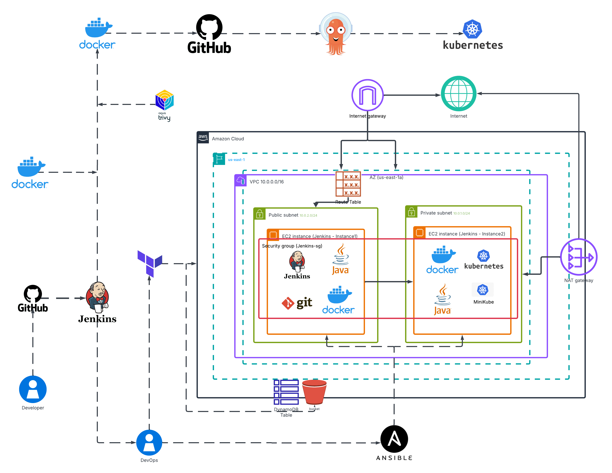

# CloudDevOpsProject

## Project Description
The project delivers a fully automated DevOps pipeline on AWS, where Terraform provisions the infrastructure and Ansible configures the servers. Jenkins builds, scans, and pushes Docker images to Docker Hub, then updates Kubernetes manifests in GitHub. ArgoCD continuously syncs those manifests to a Kubernetes cluster running on private EC2 nodes. The result is a secure, hands‑off CI/CD workflow that takes code from commit to production automatically.

## Project Architecture


## Project Structure
```bash
.
├── Dockerfile
├── K8s/
│ ├── deployment.yaml
│ └── service.yaml
├── Terraform/
│ ├── network/
│ ├── server/
│ ├── main.tf
│ └── variables.tf
├── Ansible/
│ ├── roles/
│ ├── playbook.yml
│ └── inventory/
├── jenkins-pipeline/
│ ├── Jenkinsfile
│ └── vars/
├── argocd/
│ └── application.yaml
└── README.md
```
##Containerization with Docker

### Clone the application source code
```bash 
git clone https://github.com/Ibrahim-Adel15/FinalProject.git app-source
cd app-source
```
### Create a Dockerfile 
[Dockerfile.single](Dockerfile.single)

### Build and test Docker image locally
```bash
docker build -t my-dockerhub-user/myapp:v1.0.0 .
docker run -p 5000:5000 my-dockerhub-user/myapp:v1.0.0
```
## Container Orchestration with Kubernetes

### Create Kubernetes namespace
```bash 
kubectl create namespace ivolve
```
### Apply deployment and service manifests
```bash 
kubectl apply -f K8s/deployment.yaml -n ivolve
kubectl apply -f K8s/service.yaml -n ivolve
```
###  Verify deployment
```bash
kubectl get pods -n ivolve
kubectl get svc -n ivolve
```

## Infrastructure Provisioning with Terraform
[][]

## Configuration Management with Ansible
### Run playbook to configure EC2
```bash
ansible-playbook -i inventory/aws_ec2.yml playbook.yml
```
## Continuous Integration with Jenkins
[][]

## Continuous Deployment with ArgoCD
[][]
